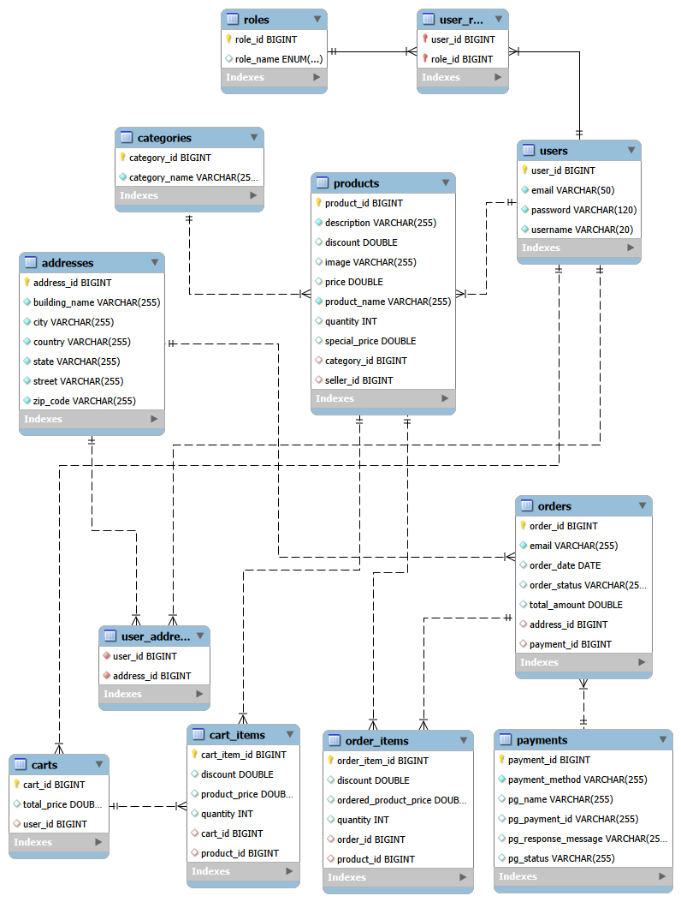

# Spring Boot E-Commerce Project 🛒

A robust and scalable e-commerce backend built with **Spring Boot**, **Spring Security**, and **JWT Authentication**. This project provides a full-featured REST API for managing categories, products, carts, orders, and user addresses.

---

## 🏗️ Project Overview

This repository contains the backend implementation for an e-commerce platform. It leverages modern Java technologies and industry-standard security practices to deliver a secure and efficient shopping experience.

### 🎥 Database ER Diagram
The following diagram illustrates the entity-relationship structure of the database:



---

## 🚀 Key Features

- **User Authentication & Authorization**: Secure login and signup using JWT (JSON Web Tokens) and Spring Security.
- **Role-Based Access Control**: Different permissions for `USER` and `ADMIN` roles.
- **Category Management**: Create, read, update, and delete product categories.
- **Product Management**: Comprehensive product catalog with image support and pagination.
- **Shopping Cart**: Add, remove, and update items in a persistent shopping cart.
- **Order Processing**: Place orders and track order history.
- **Address Management**: Users can manage multiple delivery addresses.
- **Validation**: Strict data validation using `spring-boot-starter-validation`.
- **API Documentation**: Integrated Swagger UI for easy API exploration and testing.

---

## 🛠️ Tech Stack

- **Java 21**: The latest LTS version of the Java programming language.
- **Spring Boot 4.0.1**: Core framework for building the RESTful API.
- **Spring Security & JWT**: Security layer for authentication and stateless session management.
- **Spring Data JPA**: Persistence layer using Hibernate as the ORM.
- **MySQL**: Relational database for storing application data.
- **ModelMapper**: For mapping between DTOs (Data Transfer Objects) and Entities.
- **Lombok**: To reduce boilerplate code (Getters, Setters, Constructors, etc.).
- **SpringDoc (Swagger)**: API documentation and interactive UI.
- **Maven**: Dependency management and build tool.

---

## 📂 Project Structure

```text
springboot-ecomm/
├── docs/                      # Project documentation and ER diagrams
│   └── ecommerce-er-diagram.png
├── images/                    # Storage for product and profile images
├── src/
│   ├── main/
│   │   ├── java/com/ecommerce/project/
│   │   │   ├── config/        # Configuration classes (App, ModelMapper, etc.)
│   │   │   ├── controller/    # REST Controllers for handling API requests
│   │   │   ├── exceptions/    # Global exception handling and custom exceptions
│   │   │   ├── model/         # JPA Entities representing database tables
│   │   │   ├── payload/       # DTOs (Request/Response objects)
│   │   │   ├── repositories/  # Spring Data JPA repositories
│   │   │   ├── security/      # Security config, JWT filters, and services
│   │   │   ├── service/       # Business logic implementations
│   │   │   └── util/          # Utility classes
│   │   └── resources/
│   │       ├── static/        # Static assets
│   │       ├── templates/     # View templates (if applicable)
│   │       └── application.properties # Main application configuration
│   └── test/                  # Unit and integration tests
├── pom.xml                    # Maven project configuration
└── README.md                  # Project documentation
```

---

## ⚙️ Installation & Setup

### Prerequisites
- JDK 21
- Maven 3.x
- MySQL Server

### Step 1: Clone the Repository
```bash
git clone https://github.com/your-username/springboot-ecomm.git
cd springboot-ecomm
```

### Step 2: Configure Database
1. Open MySQL and create a database named `ecommerce`.
2. Update `src/main/resources/application.properties` with your MySQL credentials:
```properties
spring.datasource.url=jdbc:mysql://localhost:3306/ecommerce
spring.datasource.username=your_username
spring.datasource.password=your_password
```

### Step 3: Build and Run
```bash
mvn clean install
mvn spring-boot:run
```
The server will start on `http://localhost:5000` (as configured in `application.properties`).

---

## 📖 API Documentation

Once the application is running, you can access the interactive Swagger documentation at:

🔗 [http://localhost:5000/swagger-ui/index.html](http://localhost:5000/swagger-ui/index.html)

This provides a detailed list of all endpoints, request bodies, and authentication requirements.

---

## 🛣️ Main Endpoints

| Category | Endpoints |
| :--- | :--- |
| **Auth** | `/api/auth/signin`, `/api/auth/signup` |
| **Categories** | `/api/public/categories`, `/api/admin/categories` |
| **Products** | `/api/public/products`, `/api/admin/products` |
| **Cart** | `/api/carts` |
| **Orders** | `/api/users/payments` |
| **Address** | `/api/addresses` |

---

## 📝 License

This project is open-source and available under the MIT License.

